# Sequence Diagrams — Spec Sign-Off Tool

---

## Developer — Happy Path: Author and Deploy a Spec

> Developer writes a YAML spec in their Rails project and deploys it to the sign-off tool so a client can review it.

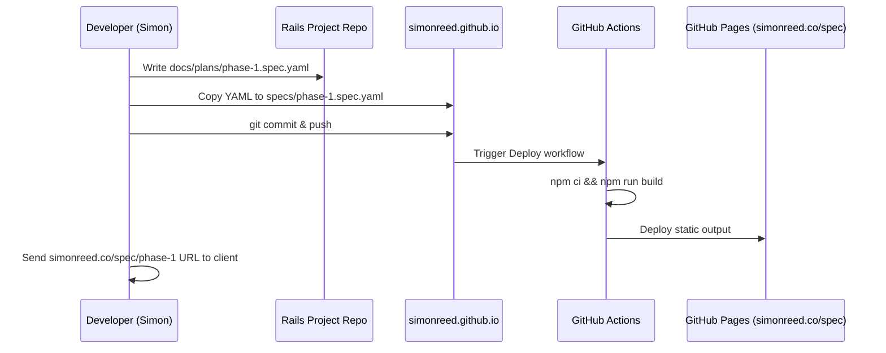
```mermaid
sequenceDiagram
  participant Dev as Developer (Simon)
  participant Repo as Rails Project Repo
  participant SpecRepo as simonreed.github.io
  participant GHA as GitHub Actions
  participant Pages as GitHub Pages (simonreed.co/spec)

  Dev->>Repo: Write docs/plans/phase-1.spec.yaml
  Dev->>SpecRepo: Copy YAML to specs/phase-1.spec.yaml
  Dev->>SpecRepo: git commit & push
  SpecRepo->>GHA: Trigger Deploy workflow
  GHA->>GHA: npm ci && npm run build
  GHA->>Pages: Deploy static output
  Dev->>Dev: Send simonreed.co/spec/phase-1 URL to client
```

---

## Developer — Deploy Fails (Build Error)

> Developer pushes a malformed or invalid YAML spec; the build fails and the old version remains live.

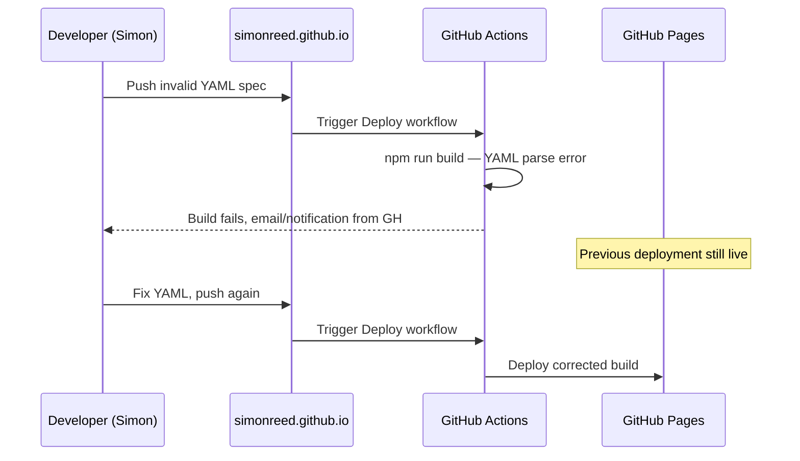
```mermaid
sequenceDiagram
  participant Dev as Developer (Simon)
  participant SpecRepo as simonreed.github.io
  participant GHA as GitHub Actions
  participant Pages as GitHub Pages

  Dev->>SpecRepo: Push invalid YAML spec
  SpecRepo->>GHA: Trigger Deploy workflow
  GHA->>GHA: npm run build — YAML parse error
  GHA-->>Dev: Build fails, email/notification from GH
  Note over Pages: Previous deployment still live
  Dev->>SpecRepo: Fix YAML, push again
  SpecRepo->>GHA: Trigger Deploy workflow
  GHA->>Pages: Deploy corrected build
```

---

## Developer — Update Spec After Client Feedback (New Version)

> Client flags assumptions or answers questions; developer incorporates feedback and publishes a new spec version.

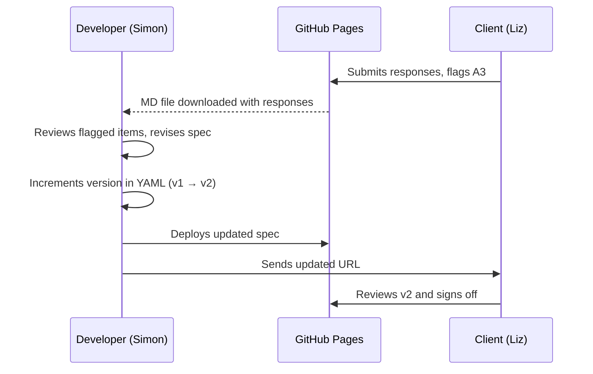
```mermaid
sequenceDiagram
  participant Dev as Developer (Simon)
  participant Pages as GitHub Pages
  participant Client as Client (Liz)

  Client->>Pages: Submits responses, flags A3
  Pages-->>Dev: MD file downloaded with responses
  Dev->>Dev: Reviews flagged items, revises spec
  Dev->>Dev: Increments version in YAML (v1 → v2)
  Dev->>Pages: Deploys updated spec
  Dev->>Client: Sends updated URL
  Client->>Pages: Reviews v2 and signs off
```

---

## Developer — Resend Link to Client

> Client hasn't received or has lost the URL; developer needs to resend it.

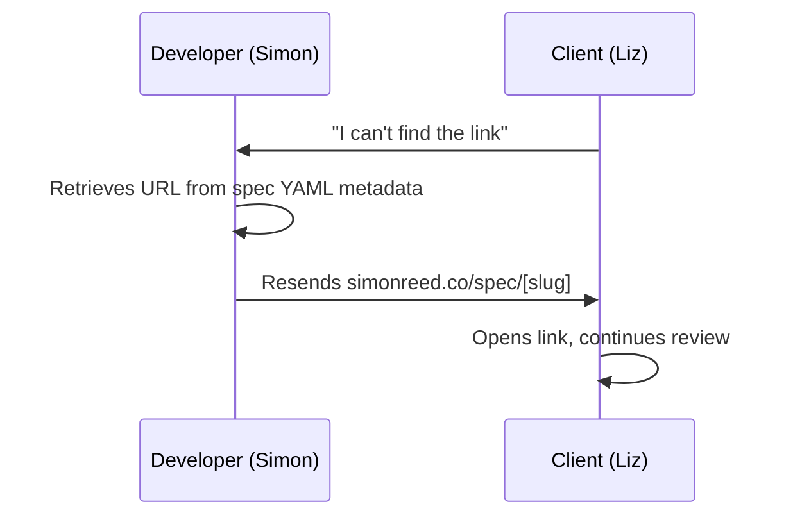
```mermaid
sequenceDiagram
  participant Dev as Developer (Simon)
  participant Client as Client (Liz)

  Client->>Dev: "I can't find the link"
  Dev->>Dev: Retrieves URL from spec YAML metadata
  Dev->>Client: Resends simonreed.co/spec/[slug]
  Client->>Client: Opens link, continues review
```

---

## Client — Happy Path: Review and Sign Off

> Client receives a URL, works through the spec top to bottom, and formally signs off.

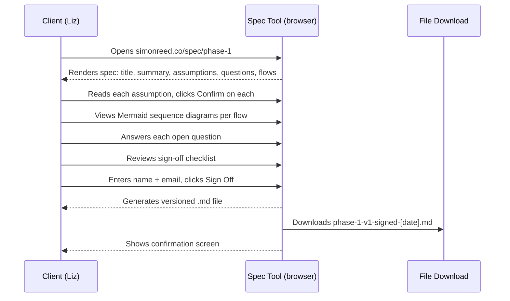
```mermaid
sequenceDiagram
  participant Client as Client (Liz)
  participant Pages as Spec Tool (browser)
  participant DL as File Download

  Client->>Pages: Opens simonreed.co/spec/phase-1
  Pages-->>Client: Renders spec: title, summary, assumptions, questions, flows
  Client->>Pages: Reads each assumption, clicks Confirm on each
  Client->>Pages: Views Mermaid sequence diagrams per flow
  Client->>Pages: Answers each open question
  Client->>Pages: Reviews sign-off checklist
  Client->>Pages: Enters name + email, clicks Sign Off
  Pages-->>Client: Generates versioned .md file
  Pages->>DL: Downloads phase-1-v1-signed-[date].md
  Pages-->>Client: Shows confirmation screen
```

---

## Client — Flags an Assumption

> Client disagrees with or wants to change one of the stated assumptions.

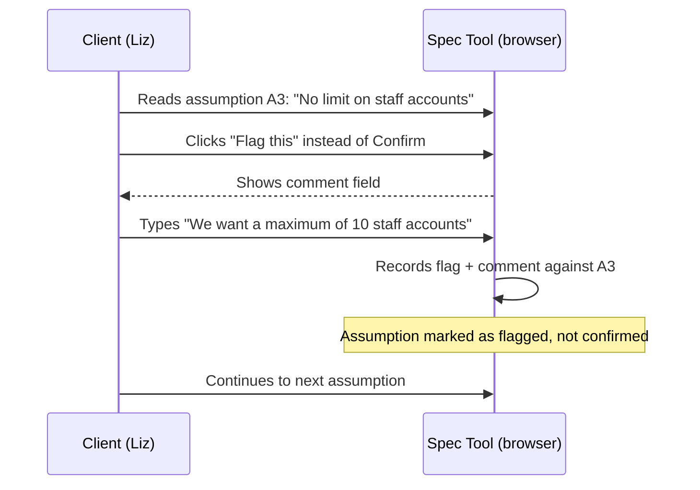
```mermaid
sequenceDiagram
  participant Client as Client (Liz)
  participant Pages as Spec Tool (browser)

  Client->>Pages: Reads assumption A3: "No limit on staff accounts"
  Client->>Pages: Clicks "Flag this" instead of Confirm
  Pages-->>Client: Shows comment field
  Client->>Pages: Types "We want a maximum of 10 staff accounts"
  Pages->>Pages: Records flag + comment against A3
  Note over Pages: Assumption marked as flagged, not confirmed
  Client->>Pages: Continues to next assumption
```

---

## Client — Answers Open Questions

> Client works through the open questions section, selecting options or typing responses.

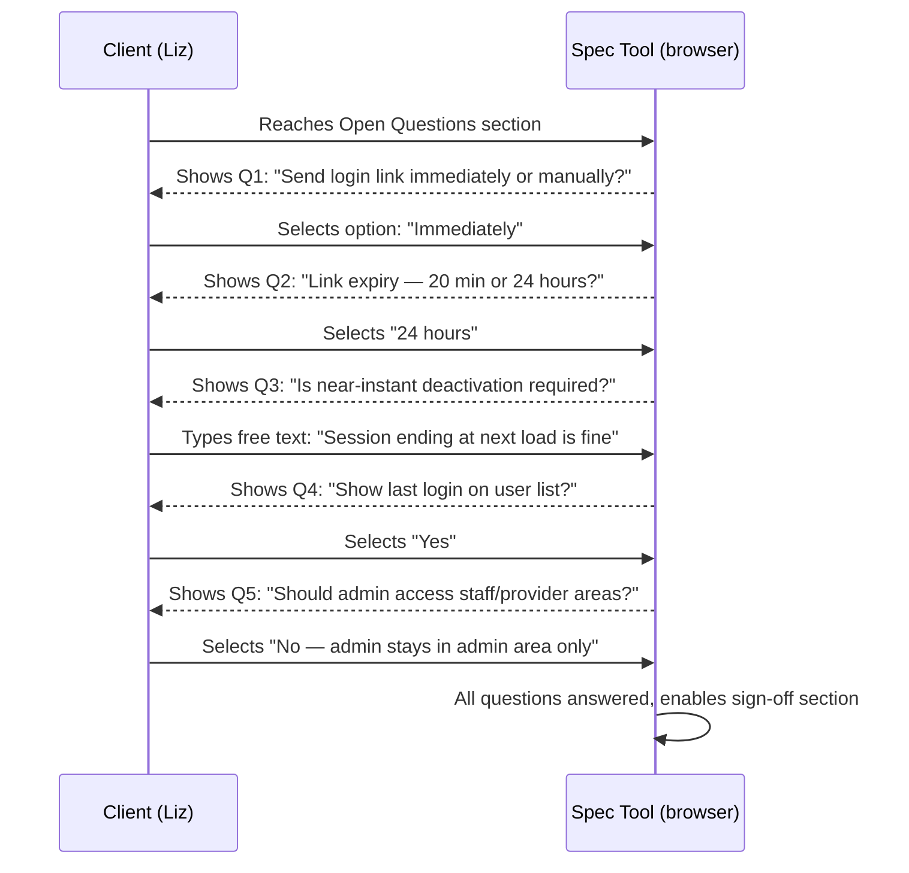
```mermaid
sequenceDiagram
  participant Client as Client (Liz)
  participant Pages as Spec Tool (browser)

  Client->>Pages: Reaches Open Questions section
  Pages-->>Client: Shows Q1: "Send login link immediately or manually?"
  Client->>Pages: Selects option: "Immediately"
  Pages-->>Client: Shows Q2: "Link expiry — 20 min or 24 hours?"
  Client->>Pages: Selects "24 hours"
  Pages-->>Client: Shows Q3: "Is near-instant deactivation required?"
  Client->>Pages: Types free text: "Session ending at next load is fine"
  Pages-->>Client: Shows Q4: "Show last login on user list?"
  Client->>Pages: Selects "Yes"
  Pages-->>Client: Shows Q5: "Should admin access staff/provider areas?"
  Client->>Pages: Selects "No — admin stays in admin area only"
  Pages->>Pages: All questions answered, enables sign-off section
```

---

## Client — Partial Completion, Returns Later

> Client starts reviewing the spec, leaves, and returns to continue from where they left off.

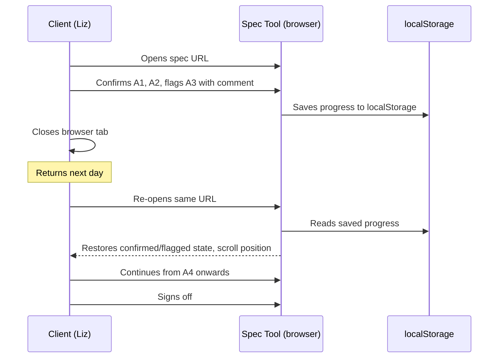
```mermaid
sequenceDiagram
  participant Client as Client (Liz)
  participant Pages as Spec Tool (browser)
  participant Storage as localStorage

  Client->>Pages: Opens spec URL
  Client->>Pages: Confirms A1, A2, flags A3 with comment
  Pages->>Storage: Saves progress to localStorage
  Client->>Client: Closes browser tab
  Note over Client: Returns next day
  Client->>Pages: Re-opens same URL
  Pages->>Storage: Reads saved progress
  Pages-->>Client: Restores confirmed/flagged state, scroll position
  Client->>Pages: Continues from A4 onwards
  Client->>Pages: Signs off
```

---

## Client — Validation Error on Sign-Off

> Client tries to submit without completing required fields or without confirming/flagging all assumptions.

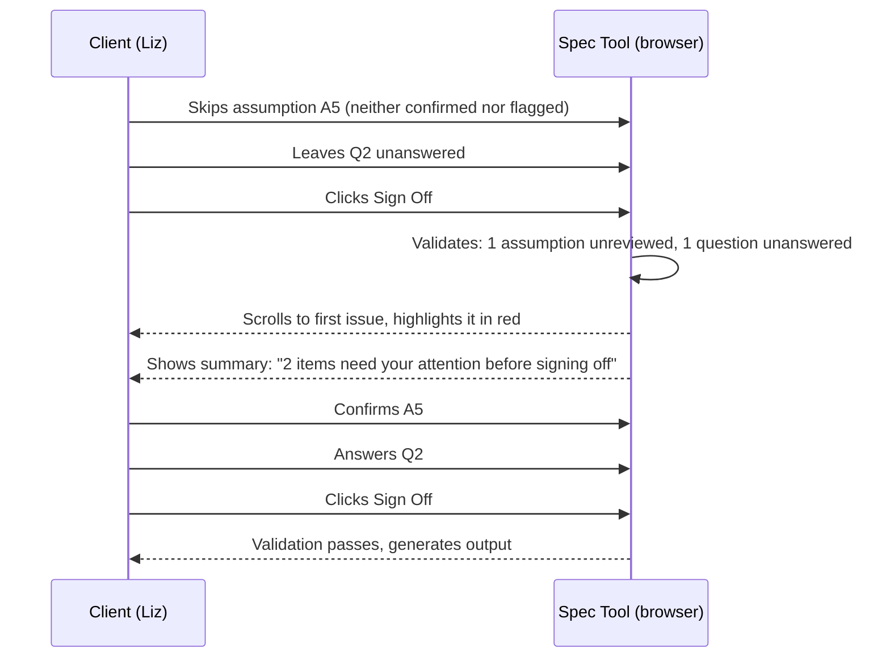
```mermaid
sequenceDiagram
  participant Client as Client (Liz)
  participant Pages as Spec Tool (browser)

  Client->>Pages: Skips assumption A5 (neither confirmed nor flagged)
  Client->>Pages: Leaves Q2 unanswered
  Client->>Pages: Clicks Sign Off
  Pages->>Pages: Validates: 1 assumption unreviewed, 1 question unanswered
  Pages-->>Client: Scrolls to first issue, highlights it in red
  Pages-->>Client: Shows summary: "2 items need your attention before signing off"
  Client->>Pages: Confirms A5
  Client->>Pages: Answers Q2
  Client->>Pages: Clicks Sign Off
  Pages-->>Client: Validation passes, generates output
```

---

## Client — Signs Off Without Flagging Anything

> Client confirms every assumption and answers every question without raising concerns.

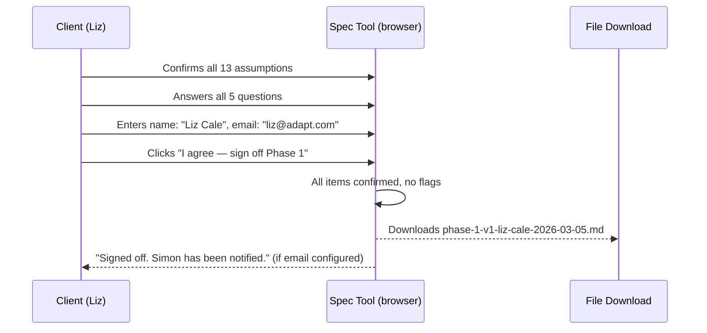
```mermaid
sequenceDiagram
  participant Client as Client (Liz)
  participant Pages as Spec Tool (browser)
  participant DL as File Download

  Client->>Pages: Confirms all 13 assumptions
  Client->>Pages: Answers all 5 questions
  Client->>Pages: Enters name: "Liz Cale", email: "liz@adapt.com"
  Client->>Pages: Clicks "I agree — sign off Phase 1"
  Pages->>Pages: All items confirmed, no flags
  Pages-->>DL: Downloads phase-1-v1-liz-cale-2026-03-05.md
  Pages-->>Client: "Signed off. Simon has been notified." (if email configured)
```

---

## Client — Spec Not Found (Wrong URL)

> Client opens a URL that doesn't match any deployed spec.

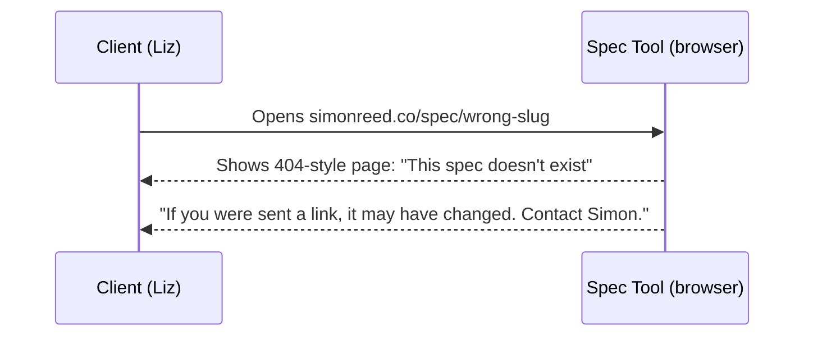
```mermaid
sequenceDiagram
  participant Client as Client (Liz)
  participant Pages as Spec Tool (browser)

  Client->>Pages: Opens simonreed.co/spec/wrong-slug
  Pages-->>Client: Shows 404-style page: "This spec doesn't exist"
  Pages-->>Client: "If you were sent a link, it may have changed. Contact Simon."
```

---

## Client — Mobile Device

> Client opens the spec on a phone rather than desktop.

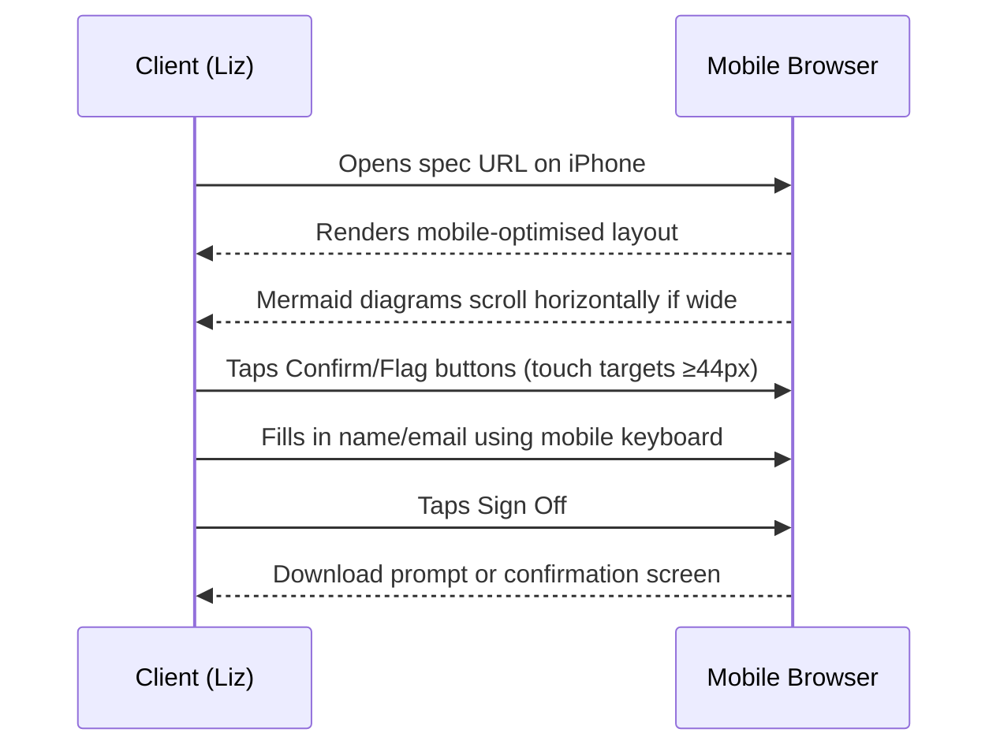
```mermaid
sequenceDiagram
  participant Client as Client (Liz)
  participant Mobile as Mobile Browser

  Client->>Mobile: Opens spec URL on iPhone
  Mobile-->>Client: Renders mobile-optimised layout
  Mobile-->>Client: Mermaid diagrams scroll horizontally if wide
  Client->>Mobile: Taps Confirm/Flag buttons (touch targets ≥44px)
  Client->>Mobile: Fills in name/email using mobile keyboard
  Client->>Mobile: Taps Sign Off
  Mobile-->>Client: Download prompt or confirmation screen
```

---

## Client — Multiple Reviewers at Same Company

> Two people at the client company both review the spec; each submits their own response.

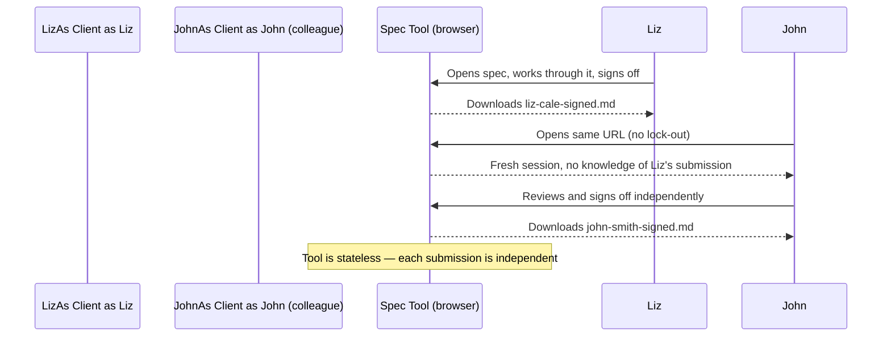
```mermaid
sequenceDiagram
  participant LizAs Client as Liz
  participant JohnAs Client as John (colleague)
  participant Pages as Spec Tool (browser)

  Liz->>Pages: Opens spec, works through it, signs off
  Pages-->>Liz: Downloads liz-cale-signed.md
  John->>Pages: Opens same URL (no lock-out)
  Pages-->>John: Fresh session, no knowledge of Liz's submission
  John->>Pages: Reviews and signs off independently
  Pages-->>John: Downloads john-smith-signed.md
  Note over Pages: Tool is stateless — each submission is independent
```

---

## Client — Attempts to Submit Twice

> Client signs off, then re-opens the URL and tries to sign off again.

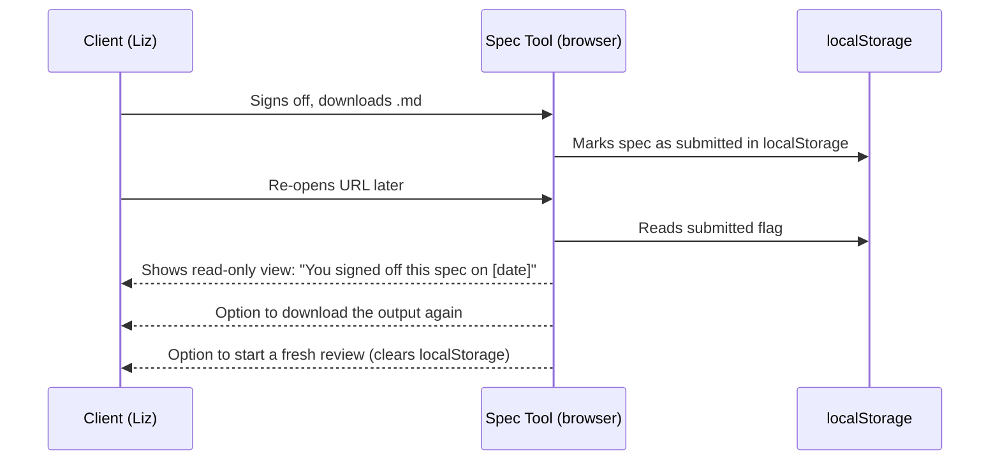
```mermaid
sequenceDiagram
  participant Client as Client (Liz)
  participant Pages as Spec Tool (browser)
  participant Storage as localStorage

  Client->>Pages: Signs off, downloads .md
  Pages->>Storage: Marks spec as submitted in localStorage
  Client->>Pages: Re-opens URL later
  Pages->>Storage: Reads submitted flag
  Pages-->>Client: Shows read-only view: "You signed off this spec on [date]"
  Pages-->>Client: Option to download the output again
  Pages-->>Client: Option to start a fresh review (clears localStorage)
```

---

## Developer — Views and Processes Client's Submitted MD

> Developer receives the generated .md file and incorporates the client's responses into the project.

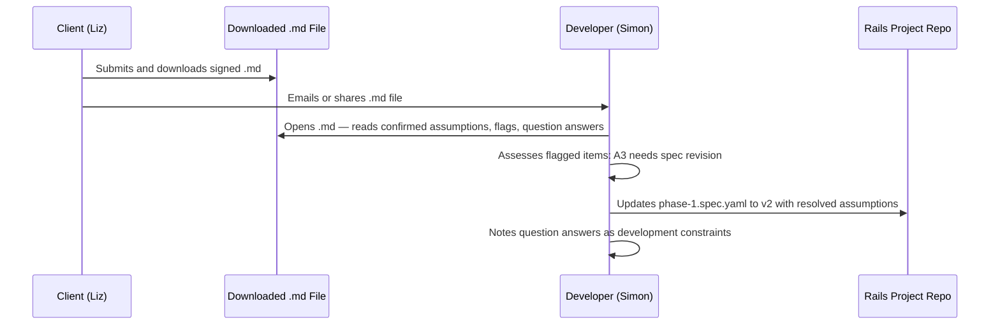
```mermaid
sequenceDiagram
  participant Client as Client (Liz)
  participant DL as Downloaded .md File
  participant Dev as Developer (Simon)
  participant Repo as Rails Project Repo

  Client->>DL: Submits and downloads signed .md
  Client->>Dev: Emails or shares .md file
  Dev->>DL: Opens .md — reads confirmed assumptions, flags, question answers
  Dev->>Dev: Assesses flagged items: A3 needs spec revision
  Dev->>Repo: Updates phase-1.spec.yaml to v2 with resolved assumptions
  Dev->>Dev: Notes question answers as development constraints
```

---

## System — GitHub Actions Build and Deploy

> Full CI/CD pipeline from spec YAML commit to live page.

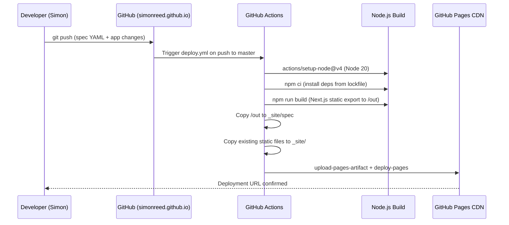
```mermaid
sequenceDiagram
  participant Dev as Developer (Simon)
  participant GH as GitHub (simonreed.github.io)
  participant GHA as GitHub Actions
  participant Node as Node.js Build
  participant Pages as GitHub Pages CDN

  Dev->>GH: git push (spec YAML + app changes)
  GH->>GHA: Trigger deploy.yml on push to master
  GHA->>Node: actions/setup-node@v4 (Node 20)
  GHA->>Node: npm ci (install deps from lockfile)
  GHA->>Node: npm run build (Next.js static export to /out)
  GHA->>GHA: Copy /out to _site/spec
  GHA->>GHA: Copy existing static files to _site/
  GHA->>Pages: upload-pages-artifact + deploy-pages
  Pages-->>Dev: Deployment URL confirmed
```

---

## Client — Spec Has No Open Questions (Edge Case)

> A spec is authored with assumptions and flows but no open questions section.

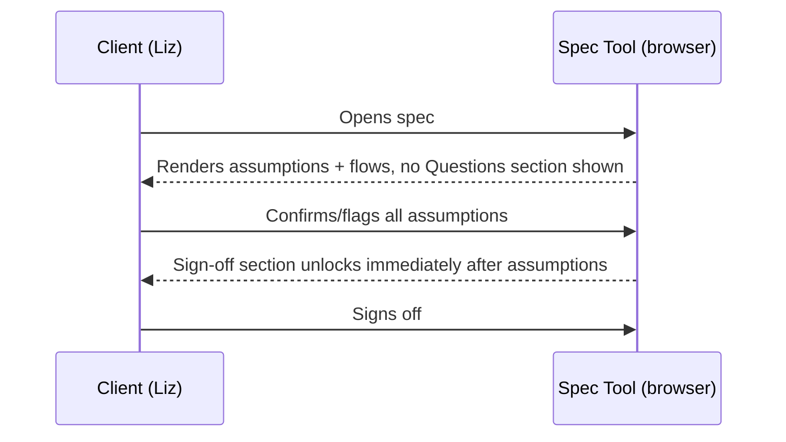
```mermaid
sequenceDiagram
  participant Client as Client (Liz)
  participant Pages as Spec Tool (browser)

  Client->>Pages: Opens spec
  Pages-->>Client: Renders assumptions + flows, no Questions section shown
  Client->>Pages: Confirms/flags all assumptions
  Pages-->>Client: Sign-off section unlocks immediately after assumptions
  Client->>Pages: Signs off
```

---

## Client — Spec Has No Mermaid Diagrams (Edge Case)

> Developer authored a spec without sequence diagrams in the flows.

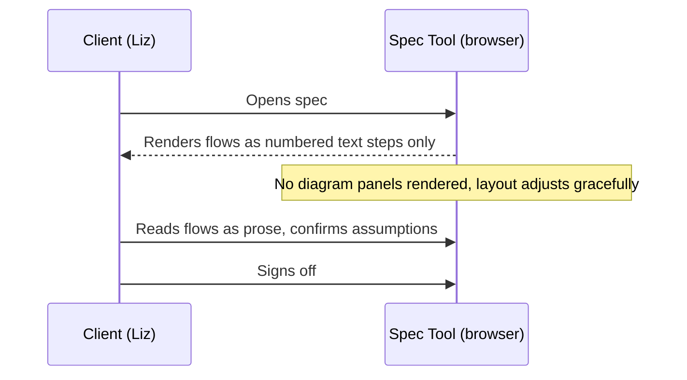
```mermaid
sequenceDiagram
  participant Client as Client (Liz)
  participant Pages as Spec Tool (browser)

  Client->>Pages: Opens spec
  Pages-->>Client: Renders flows as numbered text steps only
  Note over Pages: No diagram panels rendered, layout adjusts gracefully
  Client->>Pages: Reads flows as prose, confirms assumptions
  Client->>Pages: Signs off
```

---

## Developer — First Spec (First-Time Use of Tool)

> Developer sets up the tool for the first time and authors their very first spec YAML.

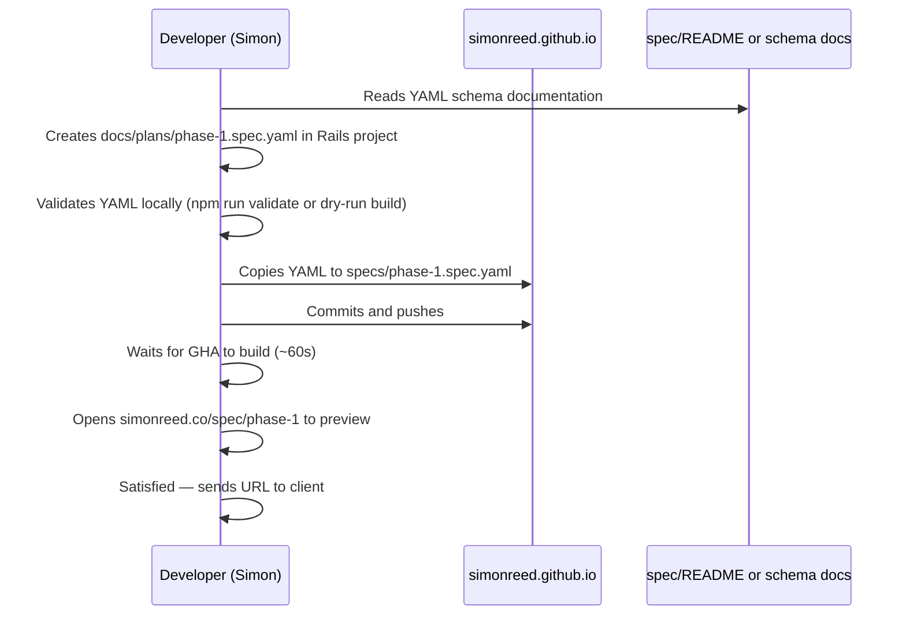
```mermaid
sequenceDiagram
  participant Dev as Developer (Simon)
  participant SpecRepo as simonreed.github.io
  participant Docs as spec/README or schema docs

  Dev->>Docs: Reads YAML schema documentation
  Dev->>Dev: Creates docs/plans/phase-1.spec.yaml in Rails project
  Dev->>Dev: Validates YAML locally (npm run validate or dry-run build)
  Dev->>SpecRepo: Copies YAML to specs/phase-1.spec.yaml
  Dev->>SpecRepo: Commits and pushes
  Dev->>Dev: Waits for GHA to build (~60s)
  Dev->>Dev: Opens simonreed.co/spec/phase-1 to preview
  Dev->>Dev: Satisfied — sends URL to client
```
