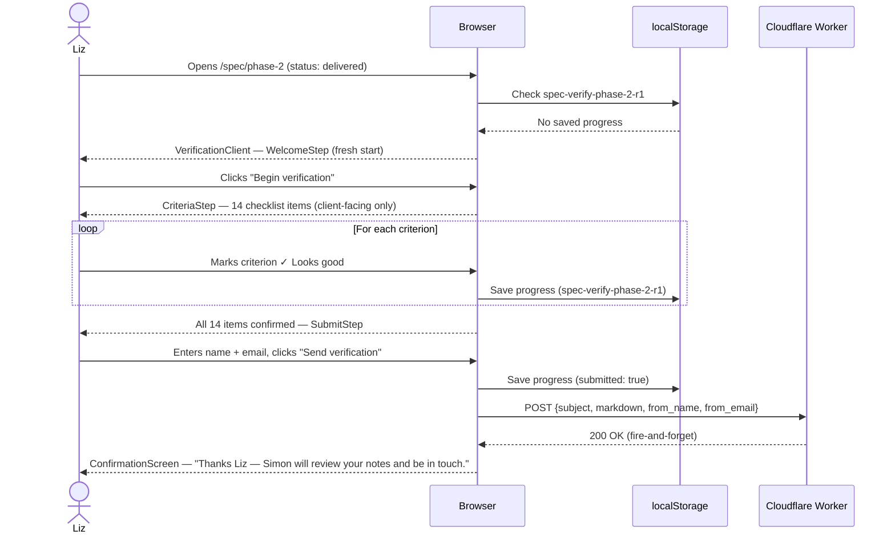
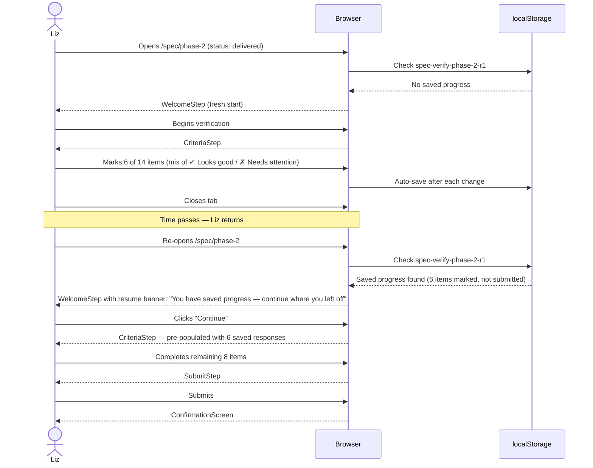
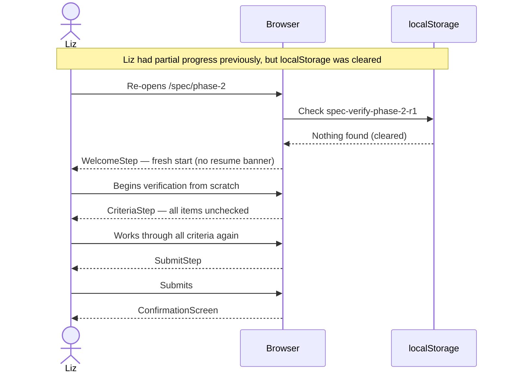
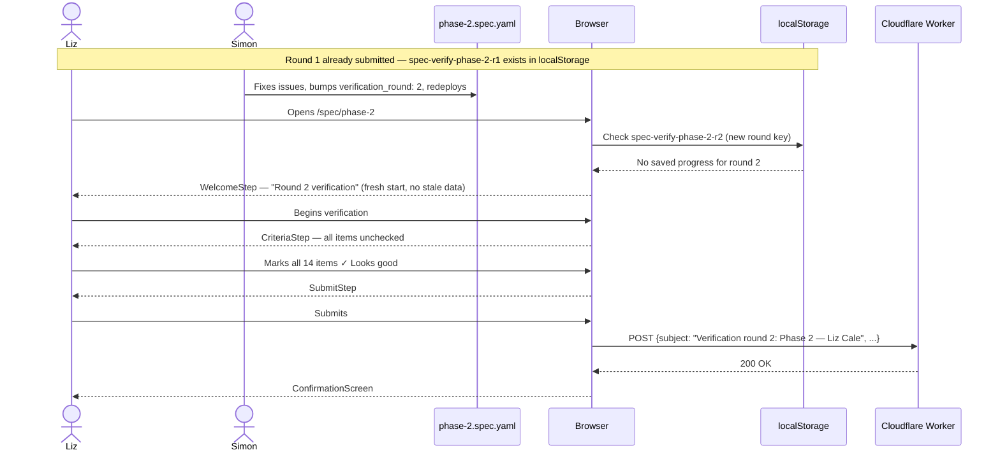
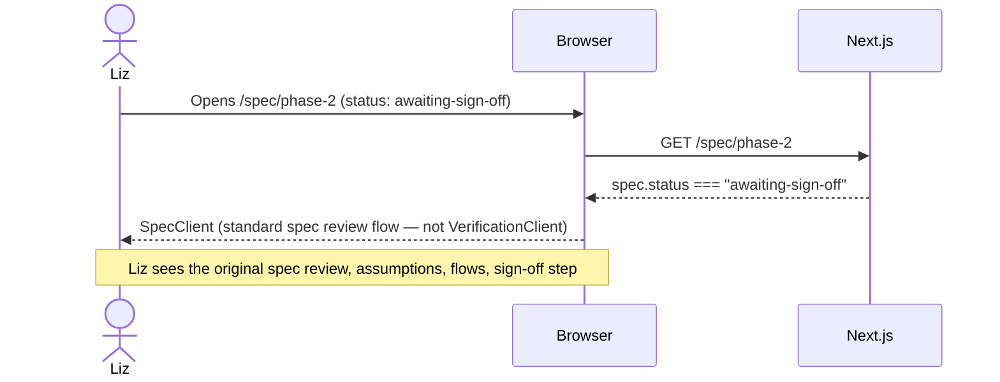
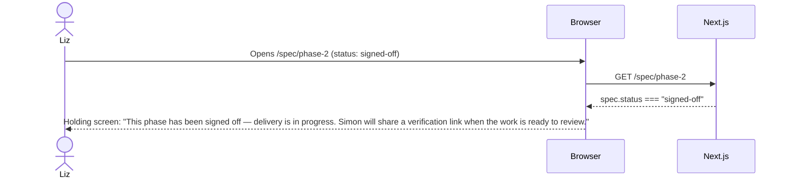
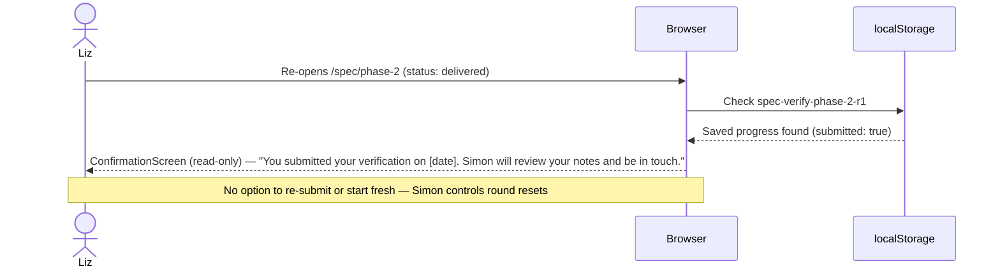
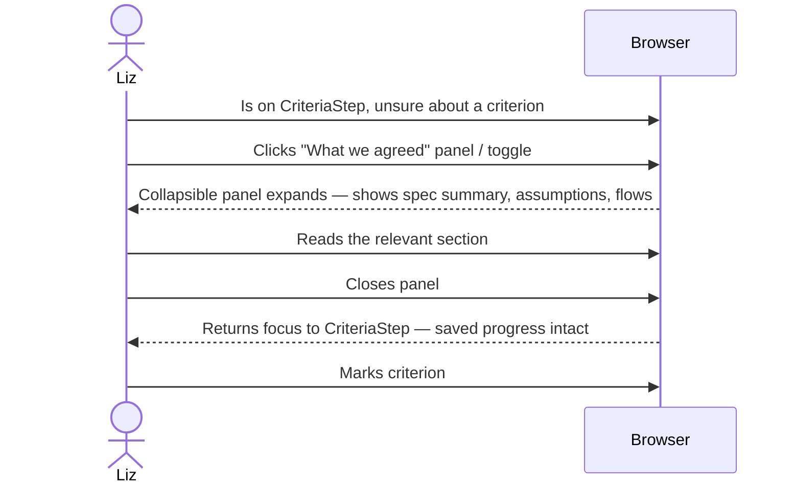
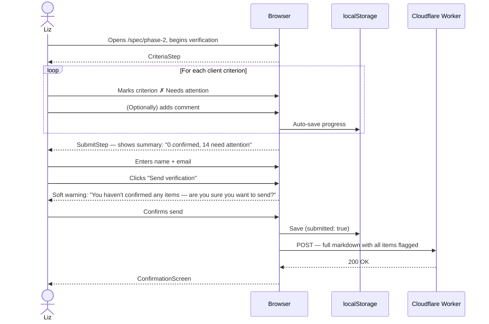
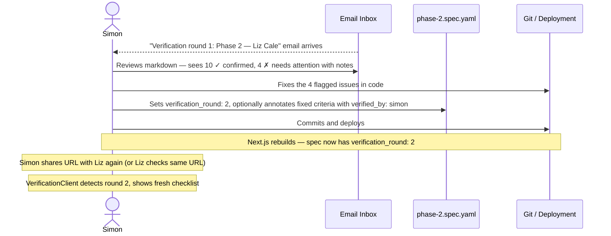

# Sequence Diagrams — Delivery Verification

These diagrams cover all permutations of the delivery verification flow for the spec sign-off tool.

---

## Liz — First-time verification, all criteria pass, submits

> Liz opens the delivered spec URL for the first time, works through all criteria marking each as "Looks good", and submits.



---

## Liz — Partial verification (some pass, some "needs attention"), closes tab, returns later

> Liz starts verification, marks some items, closes the tab, then returns and resumes from saved progress.



---

## Liz — Returns after localStorage cleared (progress lost, starts fresh)

> Liz had partial progress, but localStorage was cleared (e.g. browser data wipe). She starts over from scratch.



---

## Liz — Re-verification after Simon fixes issues (round 2)

> Simon received Liz's round-1 verification with flagged items, fixed the issues, bumped `verification_round` to 2 in the YAML, and redeployed. Liz returns to the same URL.



---

## Simon — Pre-verifies infrastructure criteria in YAML

> Simon annotates certain sign_off_criteria items with `verified_by: simon` in the YAML before sending the URL to Liz. Those items are pre-ticked and hidden from Liz's checklist.

```mermaid
sequenceDiagram
  actor Simon
  participant YAML as phase-2.spec.yaml
  participant Server as Next.js (build)
  actor Liz
  participant Browser

  Simon->>YAML: Annotates infrastructure criteria with verified_by: simon
  Simon->>Server: Redeploys / rebuilds
  Server->>YAML: parseSpec() — reads verified_by field per criterion
  Liz->>Browser: Opens /spec/phase-2
  Browser-->>Liz: WelcomeStep
  Liz->>Browser: Begins verification
  Browser-->>Liz: CriteriaStep — simon-verified items shown as locked ("Simon has verified this") and pre-confirmed; client items shown as interactive
  Note over Liz,Browser: Liz only sees and interacts with her items
  Liz->>Browser: Marks client-facing items
  Browser-->>Liz: SubmitStep
  Liz->>Browser: Submits
```

---

## Liz — Accesses URL when status is `awaiting-sign-off` (spec review mode)

> The URL is shared before delivery is confirmed. The spec is still in `awaiting-sign-off` status, so the standard SpecClient review flow is shown — not the verification flow.



---

## Liz — Accesses URL when status is `signed-off` (not yet delivered)

> The spec has been signed off but Simon has not yet deployed the delivered work. Liz sees a "not yet delivered" holding screen.



---

## Liz — Accesses URL after verification is fully complete (already submitted)

> Liz has already submitted her verification. If she returns to the URL, she sees a read-only confirmation screen.



---

## Liz — Wants to reference the original spec while doing verification

> Liz is mid-checklist and wants to remind herself what was agreed before marking a criterion.



---

## Liz — Marks all criteria as "needs attention" (worst-case)

> Liz is unhappy with everything. She marks all client-facing criteria as "Needs attention" and submits.



---

## Simon — Receives verification email with mixed results, fixes issues, flips YAML for round 2

> Simon gets the email showing 10 confirmed and 4 needing attention, fixes the code, updates the YAML, and triggers a new verification round.


